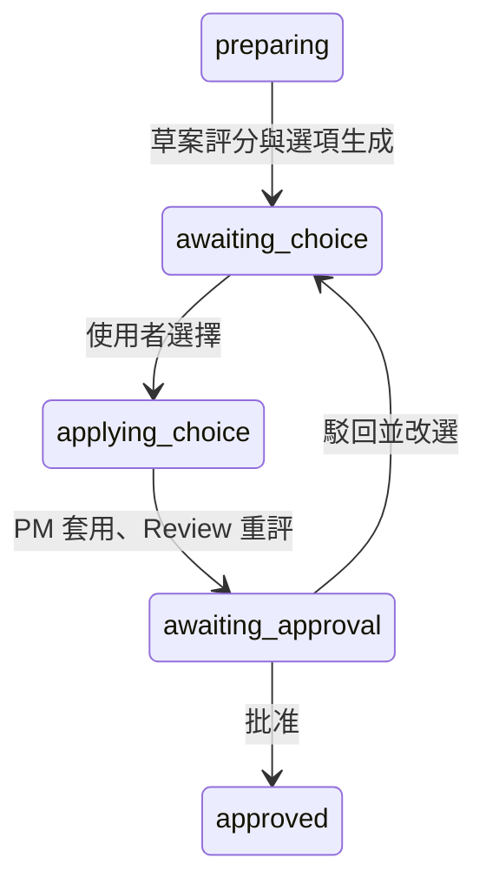

# Discord AI Agent Company 技術文件與踩雷紀錄

## 1. 文件用途

這份文件記錄專案架構、Agent 資料流、JSON 狀態、模型限制、測試方式，以及開發過程實際遇到的問題。

每次啟動前先閱讀 [README.md](README.md) 的「啟動前必讀清單」。只有在需要理解原理或排錯時，才閱讀本文件對應章節。

## 2. 系統目標

系統在 Discord 中模擬一個多角色 AI 公司：

1. 使用者從專案清單選擇需求。
2. PM 拆解需求。
3. Research 區分已知資訊、推論與待查證事項。
4. Creative 根據研究提出方案。
5. Finance 評估成本、限制、風險與替代方案。
6. 第一輪完成後，允許加入一次需求變更。
7. 四位 Agent 各自針對需求變更回應一次。
8. PM 將兩輪討論整合成草案。
9. Review 檢查四個品質維度。
10. 草案若不完整，只允許指定 Agent 修改一次。
11. PM 重新整合並保存最終方案。

## 3. 核心技術

### 3.1 Discord

`bot.py` 使用 `discord.py`：

- `commands.Bot` 處理 `!hello`、`!ask`。
- `CommandTree` 處理 `/start`、`/draft` 等 Slash Command。
- `setup_hook()` 執行 `await self.tree.sync()`，否則 Slash Command 不會出現在 Discord。
- 長時間操作先執行 `interaction.response.defer(thinking=True)`。
- defer 之後不能再次使用第一次回應，必須改用 `interaction.followup.send()`。
- `intents.message_content = True` 是文字指令讀取訊息內容的必要設定。

### 3.2 Ollama

正式服務位於 `services/llm_service.py`，使用官方 `ollama.AsyncClient`：

```python
response = await client.chat(
    model="qwen3.5:4b",
    messages=messages,
    stream=False,
    think=False,
    format=json_schema,
    options={
        "temperature": temperature,
        "seed": seed,
        "num_predict": max_output_tokens,
    },
)
```

重要選項：

- `stream=False`：等待完整結果，方便一次解析 JSON。
- `think=False`：避免 Qwen 的思考內容消耗有限的輸出預算，導致 `message.content` 空白或 JSON 不完整。
- `format=json_schema`：要求 Ollama 依 JSON Schema 輸出。
- `num_predict`：限制最大輸出 Token。
- `temperature`：控制輸出穩定性與創意程度。
- `seed`：相同輸入與參數下提高可重現性。

### 3.3 Pydantic

每個專業 Agent 都用 Pydantic v2 定義固定輸出：

```python
class ExampleAnalysis(BaseModel):
    model_config = ConfigDict(extra="forbid")

    summary: str
    items: list[str]
```

使用方式：

- `model_json_schema()`：產生交給 Ollama 的 JSON Schema。
- `model_validate_json()`：解析並驗證模型回覆。
- `extra="forbid"`：模型多輸出未定義欄位時直接拒絕。
- `Field()`、`StringConstraints`：限制陣列數量及文字長度。
- `model_validator`：檢查跨欄位規則，例如 Review 顯示「通過」時四項檢查必須全部通過。

結構化輸出採用兩層保護：

```text
Ollama JSON Schema 約束
        ↓
Pydantic 再次解析與驗證
        ↓
通過後才寫入 meetings.json
```

## 4. 架構分工

### 4.1 `bot.py`

負責：

- Discord 指令註冊
- Interaction、defer、Followup
- Embed 與訊息分段
- 將服務層錯誤轉成使用者看得懂的訊息
- 在 `main()` 建立並注入所有相依物件

不負責：

- Agent 商業邏輯
- JSON 讀寫細節
- Ollama 回覆解析規則

### 4.2 `config.py`

集中讀取 `.env`，避免每個模組自行讀取環境變數。

設定優先順序是：

```text
.env／環境變數
        ↓
Settings
        ↓
main() 注入各服務
```

服務層只接收設定值，不應再次自行呼叫 `os.getenv()`，否則測試與正式環境可能讀到不同結果。

### 4.3 `services/llm_service.py`

負責：

- 使用 `AsyncClient` 呼叫 Ollama
- 解析 `message.content`
- 記錄 Python 實際等待時間
- 保存 Prompt、Completion 與總 Token
- 將連線失敗、逾時及 Ollama API 錯誤轉成 `LLMServiceError`

### 4.4 `agents/base_agent.py`

所有 Agent 的共同底層：

- Agent 名稱
- 角色
- System Prompt
- 逾時
- temperature
- seed
- 最大輸出 Token
- JSON Schema
- 統一的 `respond()` 介面

`BaseAgent` 是模型呼叫模板，但不定義 PM 或 Finance 的專業內容。

### 4.5 `agents/structured_agent.py`

將 `BaseAgent` 與 Pydantic 串接：

1. 呼叫 BaseAgent。
2. 取得模型 JSON 文字。
3. 使用指定的 Pydantic 模型驗證。
4. 回傳結構化結果。
5. 需要時保留 Token 統計。

因此每個 Agent 不需要重複撰寫 JSON 解析與格式錯誤處理。

### 4.6 專業 Agent

| Agent | 主要輸出 | 特性 |
|---|---|---|
| PM | 目標、限制、工作項目、分歧 | 低溫度，重視整理 |
| Research | 已知、推論、待查證 | 禁止把推論當事實 |
| Creative | 具體方案、研究依據、步驟 | 較高溫度，增加變化 |
| Finance | 成本、限制、風險、替代方案 | 低溫度，不得捏造金額 |
| Review | 四項檢查、問題、指定負責人 | 固定通過或需要修改 |

### 4.7 `services/meeting_manager.py`

Meeting Manager 是整個多 Agent 流程的協調者：

- 固定 Agent 發言順序
- 建立共享 Context
- 控制第一輪與第二輪
- 使用 Guild Lock 防止同一伺服器重複啟動
- 保存每位 Agent 的輸入、輸出、Token 與耗時
- 建立 PM 草案
- 執行 Review、一次修改與最終整合
- 處理取消、失敗及恢復

### 4.8 Repository

Repository 隔離資料讀寫。Day 22 正式執行使用非同步 MySQL Repository：

- `MySQLProjectRepository`：專案、需求、驗收條件與需求變更。
- `MySQLGuildProjectStore`：每個 Guild 的目前專案。
- `MySQLMeetingRepository`：會議主檔、Agent 步驟與 Guild 最新會議索引。
- `MySQLWorkspaceRepository`：Guild 工作區、預設優先目標、成果統計與同類專案最近三筆最終方案。

MySQL 透過 `aiomysql` 連線池存取；`/start` 專案狀態與 Guild 關聯在同一交易中保存，單次會議保存也會在同一交易更新會議主檔、步驟與 Guild 索引。

JSON 實作暫時保留作為匯入與測試工具：

- `JsonProjectRepository`：讀取 `projects.json`
- `JsonGuildProjectStore`：保存每個 Guild 目前專案
- `JsonMeetingRepository`：保存會議與 Agent 發言

服務只依賴 Repository Protocol，因此測試可以換成記憶體 Fake Repository，不必碰正式 JSON。

Day 23 加入 `projects.owner_guild_id`。`NULL` 是原有共用種子專案，自訂專案只對所屬 Guild 可見且只允許該 Guild 啟動。自然語言入口透過 `MySQLProjectRepository.create_custom_project()` 以單一交易建立專案、需求及驗收條件；需求變更只在使用者看過第一輪草案並提出修改時另行保存。新會議開始前會將工作區優先目標及最近三筆經驗存入 `meeting_context`；其後調整 `/priority` 不會改動已開始會議的快照。完整會議成果以 `final_proposal IS NOT NULL` 判斷，不只看 `meetings.status`。舊的 `/custom_project` Slash Command 已移除，Repository 方法仍保留。

自然語言入口由 `PROJECT_INTAKE_CHANNEL_ID` 限定單一 Discord 頻道，預設 `0` 為關閉。`ProjectIntake` 以 Guild／頻道／使用者識別暫存對話狀態。明確符合 `START_PATTERN` 的句子直接開始收集，不呼叫模型；其他訊息交給 `ProjectIntentAgent`，以 Pydantic 限制為 `create_project`、`not_project` 或 `uncertain`，並限制標題、信心值及理由。只有 `create_project` 且信心值至少 `0.8` 才建立記憶體草稿，並先要求使用者確認模型理解到的名稱；確認前不寫入資料庫。模型逾時、服務失敗或 JSON 無效時只顯示固定輸入範例。

使用者確認意圖及完整欄位後，Bot 建立沒有預設變更的自訂專案，執行第一輪並展示 PM 草案；「直接定稿」跳到 Review，「修改：…」才新增 `requirement_changes` 並執行第二輪、重新整合及審查。入口使用 `on_message` listener，不覆蓋既有 prefix command 處理；Bot 重啟不會恢復對話階段，但已保存的專案／會議仍在 MySQL。若 Guild 已有目前專案，入口在寫入前停止。

最終方案寫入 `MySQLMeetingRepository.save()` 時，若 `meetings.status = completed` 且 `final_proposal` 非空，Repository 會在同一交易內將仍屬於該 Guild 的進行中專案標為 `completed`，並刪除該 Guild 的 `guild_current_projects` 關聯。`guild_latest_meetings` 保留舊會議索引供歷史和使用量查詢；新會議開始時，`MeetingManager` 容許上一場已有最終方案的不同專案，新紀錄保存後會更新最新會議索引。僅單輪完成或會議失敗時不釋放。

### 4.8 Day 24 可解釋方案評估

Review Agent 的四項 checklist 使用 1～5 整數分數與理由；Pydantic 在模型輸出邊界拒絕布林值、非整數及超出範圍的數值。`services/quality_evaluator.py` 不採信模型計算的總分，而是依 `MeetingContext.priority_snapshot` 套用版本化的 `day24-v1` 固定權重：

| 優先目標 | 完整度 | 創意 | 可信度 | 可行性 |
|---|---:|---:|---:|---:|
| 成長 | 30% | 25% | 15% | 30% |
| 成本效益 | 20% | 10% | 25% | 45% |
| 品牌影響 | 25% | 20% | 40% | 15% |
| 創新 | 20% | 45% | 15% | 20% |

公式為 `weighted_score = Σ(score × weight)`，再以 `quality_index = weighted_score / 5 × 100` 換算為 0～100。Python 依低於 4 分的面向產生固定風險及改善建議，確保相同 Review 輸入和優先目標得到完全相同輸出。評估包含公式版本、受評方案、目標、四項分數、理由、權重、總分、品質指標、級別、風險、改善建議與文字說明。草案評分附加在 `meetings.review_result.quality_evaluation`；若修改過一次，PM 整合最終方案後再次呼叫 Review，修改後評分附加在 `meetings.review_result.post_revision_review.quality_evaluation`。兩次評分分開顯示，沿用現有 JSON 欄位，不需要 schema migration。第二次 Review 不會觸發額外修改。

## 5. 完整會議流程

### 5.1 第一輪 `/start`

固定順序：

```text
PM → Research → Creative → Finance
```

Review 不在第一輪，因為此時還沒有 PM 整合草案。

每個 Guild 同一時間只能有一場會議。不同 Guild 可以同時執行，因為 Lock 以 Guild ID 分開保存。

### 5.2 共享內容

後面的 Agent 不會取得前面 Agent 的完整 Prompt，只取得需要的輸出欄位：

- Research 讀取 PM 的目標、限制、工作與分歧。
- Creative 讀取 Research 的已知資訊、推論與待查證事項。
- Finance 讀取 PM 限制、Research 內容與 Creative 方案。

這些規則由 `RELEVANT_OUTPUT_FIELDS` 與 `SECOND_ROUND_RELEVANT_OUTPUT_FIELDS` 控制。

目的：

- 降低 Context 膨脹
- 減少重複資訊
- 降低模型混淆與幻覺
- 控制 Prompt 時間與記憶體用量

### 5.3 第二輪 `/change`

一場會議最多加入一次需求變更。

每位 Agent 必須針對新限制補充、反對或修正，不允許只回覆「我同意」。每位 Agent 在第二輪只回應一次。

### 5.4 PM 草案 `/draft`

PM 收到已完成的一輪或兩輪內容：

- 第一輪摘要
- 第二輪摘要（若使用者提出變更）
- 重要原文
- 專案需求與需求變更

固定輸出：

- 標題
- 摘要
- 專案背景與目標
- 整合方案
- 執行計畫
- 風險與對策
- 驗收標準
- 採用、拒絕與折衷決策

草案保存在 `proposal_draft`，統計保存在 `proposal_metrics`。

### 5.5 Review 與最終方案 `/review`

Review 檢查：

1. 完整度
2. 創意
3. 可信度
4. 可行性

若通過，初稿直接成為最終方案。

若需要修改：

1. 每項問題提供 `problem`、`required_change`、`priority`、`assigned_agent`。
2. 程式選擇最高優先級問題。
3. 將同一負責人的要求交給指定 Agent。
4. 修改成功後將 `revision_count` 設為 `1`。
5. PM 重新整合 `final_proposal`。
6. 再次執行 `/review` 只讀取快取，不會開始第二次修改。

## 6. 狀態與 JSON

### 6.1 `projects.json`

保存：

- 專案 ID
- 類別
- 標題
- 需求
- 預算
- 期限
- 驗收條件
- 專案狀態
- 至少五種需求變更案例

### 6.2 `guild_projects.json`

保存 Guild 目前啟動的專案。它不代表完整 Agent 討論內容。

### 6.3 `meetings.json`

主要結構：

```text
guilds
└── guild_id → meeting_id

meetings
└── meeting_id
    ├── status
    ├── steps
    ├── meeting_context
    ├── applied_requirement_change
    ├── proposal_draft
    ├── proposal_metrics
    ├── review_result
    ├── revision_count
    ├── revision_agent_name
    ├── revision_output
    ├── final_proposal
    └── final_proposal_metrics
```

每個 `steps` 項目會保存：

- Agent 名稱
- 發言順序
- 討論輪次
- 狀態
- 輸入與輸出
- 輸入與輸出字元
- Prompt 與 Completion Token
- 最大輸出 Token
- 執行時間
- 安全錯誤訊息

### 6.4 會議狀態

```text
pending → running → completed
                  ↘ failed → running
                  ↘ cancelled
```

`completed` 表示目前階段完成，不一定代表整個專案生命週期永久結束。第二輪流程會在既有會議紀錄上繼續增加步驟。

### 6.5 何時重置 JSON

正常使用不要手動重置，因為系統需要先前輪次、草案與修改次數。

只有想完全重新測試整條流程時，先停止 Bot，再將 `meetings.json` 改成：

```json
{
  "guilds": {},
  "meetings": {}
}
```

必要時也將 `guild_projects.json` 改成 Repository 預期的空白結構。不要在 Bot 執行途中修改 JSON，否則記憶中的流程與磁碟狀態可能不一致。

## 7. 長度、Token 與逾時

### 7.1 字元不等於 Token

- 字元限制保護 Discord 訊息與 JSON 大小。
- Token 限制控制模型可以產生多少內容。
- 中文一個字不一定等於一個 Token。
- JSON 欄位名稱、括號與標點也會計入字元與 Token。

因此系統同時記錄：

- `input_characters`
- `output_characters`
- `prompt_tokens`
- `completion_tokens`
- `max_output_tokens`

達限制 80% 顯示 `⚠️`，達 95% 顯示 `🚨`。

### 7.2 目前預算

| 項目 | 預設值 |
|---|---:|
| `!ask` 輸入 | 500 字元 |
| `!ask` 輸出 | 1900 字元 |
| Discord 會議單段 | 1900 字元 |
| 單次 Agent Prompt | 6000 字元 |
| 單次結構化回覆 | 4000 字元 |
| Ollama 整體請求逾時 | 300 秒 |
| PM 整合逾時 | 180 秒 |

不同 Agent 另外設定自己的 `max_output_tokens`。PM 整合草案目前為 1600 Token。

### 7.3 為什麼不是一直調高上限

上限太低會截斷 JSON；但無限制調高也會造成：

- 回覆時間增加
- Context 變大
- 小模型更容易離題或重複
- JSON 格式失敗時浪費更多時間
- Discord 最終仍有訊息限制

先查看實際統計，再決定是否調整。不要因為一次失敗就直接把所有限制加倍。

## 8. 測試策略

### 8.1 Fake Response 的用途

Fake 測試不啟動 Ollama，主要驗證：

- 呼叫參數是否正確
- Agent 是否解析 JSON
- Pydantic 是否拒絕錯誤格式
- Agent 順序是否固定
- Guild Lock 是否有效
- 狀態是否保存
- 最多修改一次是否有效
- Discord 訊息是否超過上限

它不是多餘程式碼，而是避免每次改動都花數十秒呼叫模型。

### 8.2 手動模型測試

`manual_test.py` 測試官方 Ollama Python 套件版本。

`manual_testapi.py` 測試直接呼叫 HTTP `/api/chat` 的版本。

目前正式 Bot 使用 `services/llm_service.py` 的 Ollama Python 套件；`llm_serviceapi.py` 保留作為學習與比較用途。

### 8.3 修改後的最低驗證

```bash
python -m unittest discover -s tests
python -m py_compile bot.py agents/*.py models/*.py services/*.py repositories/*.py
python -m json.tool projects.json
git diff --check
```

## 9. 實際踩過的雷

### 雷 1：Ollama address already in use

錯誤：

```text
Error: listen tcp 127.0.0.1:11434: bind: address already in use
```

原因：已經有 Ollama 程序監聽 11434，再執行一次 `ollama serve` 才會衝突。

正確判斷：

```bash
curl http://127.0.0.1:11434/api/tags
```

有回應代表服務正常，不要重複啟動。

### 雷 2：Slash Command 寫好了但 Discord 看不到

可能原因：

- 邀請 Bot 時缺少 `applications.commands` Scope
- 沒有執行 `CommandTree.sync()`
- Bot 尚未重新啟動
- Discord 客戶端快取尚未更新
- Bot 沒有伺服器或頻道權限

本專案在 `MyBot.setup_hook()` 同步全域指令。新增指令後必須重啟 Bot。

### 雷 3：defer 後再次使用 response

Interaction 第一次回覆只能使用一次。執行：

```python
await interaction.response.defer(thinking=True)
```

後續必須使用：

```python
await interaction.followup.send("完成")
```

不能再呼叫 `interaction.response.send_message()`。

### 雷 4：PM、Research 或 Finance 顯示「執行失敗」

Discord 只顯示安全錯誤，真正原因通常在底層例外或終端日誌：

- Ollama 沒有啟動
- 模型沒有下載
- 回覆逾時
- 模型輸出不是合法 JSON
- JSON 缺少必要欄位
- 多輸出 Schema 不允許的欄位
- 陣列或文字超過 Pydantic 上限
- Prompt 或回覆超過字元預算
- 輸出 Token 用完，JSON 在中途被截斷

排錯順序：

1. `curl /api/tags` 確認 Ollama。
2. `ollama list` 確認 `qwen3.5:4b`。
3. 執行 `manual_test.py`。
4. 查看 `meetings.json` 失敗步驟的輸入、字元與時間。
5. 查看終端日誌。
6. 再檢查 Agent Schema 與 Prompt。

### 雷 5：Qwen 有 Token 使用量但 `message.content` 空白

Qwen 可能把有限的 `num_predict` 用在 thinking 階段，導致真正回答沒有剩餘空間。

本專案在 Ollama request 設定：

```python
"think": False
```

不要在不理解影響時移除這項設定。

### 雷 6：PM 草案一直逾時

PM 整合兩輪摘要比一般 Agent 工作量大。原本沿用較短逾時，模型可能在即將完成前被取消。

目前：

- PM Integration Agent：180 秒
- Ollama Client：300 秒

如果模型實際需要 70～90 秒，這不代表當機。先查看執行時間，再判斷是否調整。

### 雷 7：增加輸出上限不一定解決問題

格式錯誤可能來自 Prompt 不清楚、Schema 太複雜或模型能力不足，而不只是上限太小。

先查看：

- Completion Token 是否接近上限
- 輸出字元是否接近 4000
- Pydantic 是缺欄位、型別錯誤還是多欄位

只有確定被截斷時才提高 Token。

### 雷 8：Context 全部塞進 Prompt

把所有 Agent 的完整 Prompt 與輸出交給下一位 Agent，會讓內容快速膨脹，也更容易讓小模型混淆來源。

本專案改成：

- 保存完整原文到 JSON
- 傳遞時只選取相關欄位
- 每輪另外保存摘要
- 每項建議記錄提出者

資料庫或 JSON 可以保存完整歷史，但送給模型的 Context 必須經過選擇。

### 雷 9：固定 Seed 不代表每次百分之百相同

Seed、temperature、模型版本、Ollama 版本、硬體與 Prompt 都可能影響結果。

低 temperature 與固定 Seed 只能提高穩定性，不代表輸出文字保證完全一致。

### 雷 10：Fake 測試成功，但正式模型仍失敗

Fake Response 已經是預先準備好的合法資料，因此主要測試程式流程。真實模型仍可能逾時、離題或輸出錯誤格式。

所以需要兩種測試：

```text
單元測試：快速、穩定、驗證程式邏輯
手動測試：較慢、驗證 Ollama 與真實模型
```

### 雷 11：`meetings.json` 的快取讓結果看起來沒有更新

`/draft` 與 `/review` 會優先讀取已保存結果，避免重複消耗模型時間。

修改 Prompt 後直接重跑相同指令，可能看到舊草案。要完整重測：

1. 停止 Bot。
2. 備份需要保留的紀錄。
3. 重置 `meetings.json`。
4. 重新啟動 Bot。
5. 從 `/start` 開始完整流程。

### 雷 12：`completed` 不等於 JSON 自動知道會議結束

JSON 只是保存字串，真正理解狀態的是 Python：

- `MeetingStatus` 定義合法值。
- `can_transition_to()` 定義合法轉換。
- Meeting Manager 根據狀態決定能否繼續。

手動把 JSON 改成 `completed` 不會自動補齊缺少的 Agent 輸出。

### 雷 13：一個 Guild 不能同時開兩場會議

這是刻意限制，不是 Bug。Guild Lock 防止重複啟動和 JSON 相互覆寫。

不同 Discord 伺服器有不同 Guild ID，因此可以同時進行不同會議。

### 雷 14：Review 不能無限要求修改

Review 模型輸出的 `revision_allowed` 不被直接信任，程式會根據 `revision_count` 重新決定。

`revision_count` 的合法值只有 `0` 和 `1`。修改成功後就固定為 1，再次執行 `/review` 只讀取最終方案。

### 雷 15：Git 把不該上傳的檔案加入暫存

不要習慣直接執行：

```bash
git add .
```

因為 `.DS_Store`、備份 JSON、報告或執行資料可能一起進入暫存。

先看：

```bash
git status --short
```

只加入需要的路徑。誤加入 `docs` 時可取消：

```bash
git restore --staged docs/
```

這只取消暫存，不會刪除本機檔案。

### 雷 16：不要提交 `.env`

`.env` 含 Discord Token。即使之後刪除，Token 仍可能留在 Git 歷史。

若 Token 曾經推到 GitHub，不能只刪檔案，必須立即到 Discord Developer Portal 重新產生 Token。

## 10. 日誌與安全

目前日誌會記錄：

- Guild ID
- 專案 ID
- 模型名稱
- 字元數
- Token 數
- 執行時間
- 安全錯誤摘要

不應記錄：

- Discord Token
- `.env` 完整內容
- 使用者私人 Prompt 全文
- 未處理的敏感例外內容

`meetings.json` 會保存完整 Agent 輸入與輸出，因此不要提交到公開 GitHub。

## 11. 開發新功能時的檢查順序

1. 先定義資料模型與合法狀態。
2. 再定義 Agent Schema 與 Prompt。
3. 使用 Fake Response 測試成功與失敗。
4. 接入 Meeting Manager。
5. 最後接 Discord 指令與 Embed。
6. 執行全部測試。
7. 使用真實 Ollama 手動測試。
8. 檢查 `git status`，確認沒有 Token、會議 JSON 或系統檔案。

## 12. 官方文件

- discord.py：<https://discordpy.readthedocs.io/>
- Discord Developer Portal：<https://discord.com/developers/applications>
- Ollama Python：<https://github.com/ollama/ollama-python>
- Ollama API：<https://github.com/ollama/ollama/blob/main/docs/api.md>
- Pydantic：<https://docs.pydantic.dev/>


## 13. Day 25 使用者決策

新會議在第一次保存前寫入 `decision_owner_user_id` 與 `decision_status=preparing`。Agent 執行狀態仍由 `MeetingStatus` 表示，使用者決策另有狀態：



- `models/user_decision.py` 驗證來源、2～3 個唯一選項與影響章節；`agents/pm_agent.py` 使用獨立的決策與套用選擇 schema。
- `services/user_decision_service.py` 共用授權、選擇、評分、批准與駁回流程；Bot/View 不直接執行 SQL。
- `views/decision_view.py` 提供持久 View，啟動時依 `decision_messages` 重新 `add_view`。按鈕與 `/decide` 呼叫同一服務。
- `candidate_review` 包含受評方案 SHA-256 與決策版本。批准時檢查兩者，避免接受未評分的新內容。
- `decision_version` 阻擋舊按鈕，`storage_version` 阻擋所有過期會議寫入。MySQL 保存前鎖住會議列，檢查版本，再於同一交易保存主檔、步驟與完成狀態；模型呼叫在交易外執行。
- 使用者選擇先保存，處理保留 15 分鐘。正常失敗會解除保留以便重試；程序中斷後等保留到期即可續跑。已保存的候選方案與相同輸入的成功審查／修改步驟可復用。
- 草案 Review 保存在 `review_result`；候選與自動修改後評分保存在 `user_decision.evaluations` 及最新 `candidate_review`。批准／駁回時將該輪評分、影響與方案一起保存至 `user_decision.history`。
- 只有 `approved` 的新版方案可寫入 `final_proposal`，進而觸發專案完成與 Guild 釋放。等待期間不納入近期完成經驗；`legacy` 會議保持舊格式相容。

Day 25 的版本欄位需先套用 `003_day25_user_decision.sql`，再啟動新版 Bot。單一會議原有的一次自動修改限制不因駁回而重設。
